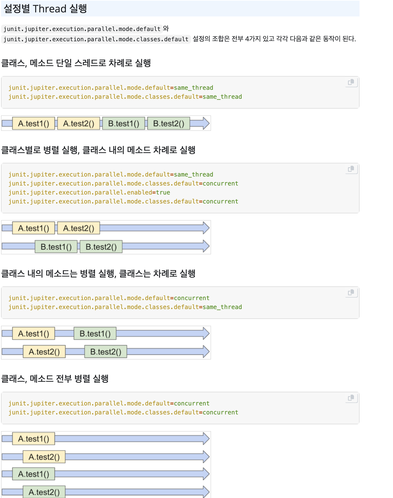

테스트 환경 통합 및 격리 실행 전략
---
테스트 작성 규칙이 없다면 애플리케이션의 실행/빌드 시간에 큰 영향을 미치게 된다.

- 테스트 컨텍스트 캐싱을 제대로 활용할 수 없어 생성 비용이 크게 늘어난다.
- 구성한 테스트 환경의 의도와 맞지 않는 테스트 코드가 작성된다.
- 불필요하게 많은 테스트 데이터로 인해 완료되는데 오래 걸리는 테스트 코드가 작성된다.
- 실제 운영에서 사용할 데이터베이스 환경과 일치하지 않아 잠재적인 문제점을 해결하기 어렵다.

## 테스트 환경 통합
먼저 테스트 레이어를 정리한다.
1. 단위 테스트
2. 통합 테스트
3. 웹 계층 슬라이스 테스트
4. 인수 테스트

테스트 레이어별 코드 작성 방법과 환경은 다음과 같다.

**단위 테스트**
단위 테스트는 최대한 비즈니스 로직에 집중해 작게 테스트를 작성하는 것이 핵심이다. 비즈니스 로직을 검증하는 것이 목적이기 때문에 유스케이스의 흐름을 담당하는 서비스를 테스트하기 보단 핵심 도메인 로직에 대한 테스트를 작성해야 한다.

```java
@Tag("unit-test")
@Target(ElementType.TYPE)
@Retention(RetentionPolicy.RUNTIME)
@ExtendWith(MockitoExtension.class)
@Execution(value = ExecutionMode.CONCURRENT)
public @interface UnitTest {
}
```

- `MockitoExtension` 을 통해 모킹을 사용할 수 있지만 작은 단위의 도메인 로직에 대해 작성한다면 자주 사용되지 않을 것이다.
- `@Execution(value = ExecutionMode.CONCURRENT)` 를 통해 클래스 내부의 각 테스트 케이스를 병렬로 실행한다.

**통합 테스트**
서비스가 유스케이스에 따라 정확한 흐름으로 실행되는지 확인하기 위해 작성한다. 서비스의 전체적인 동작을 검증하는 것이 목적이기 때문에 입력과 출력 값을 위주로 테스트를 작성해야 한다. 
또한, 롤백 테스트로 작성할 것인지에 따라 직접 데이터를 초기화 해주어야 할 수 있기 때문에 서비스의 통합 테스트에서 사용되는 어노테이션은 두 가지로 나뉜다.

```java
@Tag("transactional-svc-test")
@Target(ElementType.TYPE)
@Retention(RetentionPolicy.RUNTIME)
@ActiveProfiles("tc-mariadb")
@SpringBootTest
@Transactional
@Execution(value = ExecutionMode.CONCURRENT)
public @interface TransactionalServiceTest {
}
```

- `@ActiveProfiles` 를 통해 운영에서 사용하는 데이터베이스 환경과 일치시켜 실행한다.
- `@SpringBootTest` 를 통해 테스트 컨텍스트를 생성하기 떄문에 네트워크와 같이 통제할 수 없는, 꼭 필요할 경우에만 `@MockBean` 을 사용한다.
- `@Transactional` 롤백 테스트로 동작한다.
- `@Execution(value = ExecutionMode.CONCURRENT)` 각 테스트 케이스는 commit을 하지 않아 데이터 격리가 보장되기 때문에 병렬로 실행이 가능하다.

```java
@Tag("non-transactional-svc-test")
@Target(ElementType.TYPE)
@Retention(RetentionPolicy.RUNTIME)
@ActiveProfiles("tc-mariadb")
@SpringBootTest
@TestExecutionListeners(
    value = {IntegrationTestExecutionListener.class},
    mergeMode = TestExecutionListeners.MergeMode.MERGE_WITH_DEFAULTS
)
public @interface NonTransactionalServiceTest {
}

----

@Slf4j
class IntegrationTestExecutionListener extends AbstractTestExecutionListener {

    @Override
    public void afterTestMethod(TestContext testContext) {
        JdbcTemplate jdbcTemplate = testContext.getApplicationContext().getBean(JdbcTemplate.class);

        try (Connection conn = Objects.requireNonNull(jdbcTemplate.getDataSource()).getConnection()) {
            String dbProductName = conn.getMetaData().getDatabaseProductName().toLowerCase(Locale.ROOT);

            if (dbProductName.contains("h2")) truncateAllTablesInH2(jdbcTemplate);
            else if (dbProductName.contains("mysql") || dbProductName.contains("mariadb")) truncateAllTablesInMariaDB(jdbcTemplate);
            else throw new UnsupportedOperationException("Unsupported DB type: " + dbProductName);

            log.info("Successfully cleared data in the TC DB");
        } catch (SQLException e) {
            throw new RuntimeException(e);
        }
    }

    private void truncateAllTablesInH2(JdbcTemplate jdbcTemplate) {
        List<String> truncateQueries = jdbcTemplate.queryForList("SELECT Concat('DELETE FROM ', TABLE_NAME, ';') AS q FROM INFORMATION_SCHEMA.TABLES WHERE TABLE_SCHEMA = 'PUBLIC'", String.class);

        jdbcTemplate.execute("SET REFERENTIAL_INTEGRITY FALSE");
        truncateQueries.forEach(jdbcTemplate::execute);
        jdbcTemplate.execute("SET REFERENTIAL_INTEGRITY TRUE");
    }

    private void truncateAllTablesInMariaDB(JdbcTemplate jdbcTemplate) {
        List<String> truncateQueries = jdbcTemplate.queryForList("SELECT Concat('DELETE FROM ', TABLE_NAME, ';') AS q FROM INFORMATION_SCHEMA.TABLES WHERE TABLE_SCHEMA = DATABASE() AND TABLE_TYPE = 'BASE TABLE'", String.class);

        jdbcTemplate.execute("SET FOREIGN_KEY_CHECKS = 0");
        truncateQueries.forEach(jdbcTemplate::execute);
        jdbcTemplate.execute("SET foreign_key_checks = 1");
    }
}
```

- `@TestExecutionListener` 를 사용해 테스트에서 사용된 데이터를 초기화한다. ( 전체 테이블 초기화)
- `DELETE` 대신 `TRUNCATE` 를 사용하면 성능을 더 향상시킬 수는 있다.

**웹 계층 테스트**
`@WebMvcTest` 를 통해 웹 계층만을 포함한 테스트 컨텍스트를 생성하고, 이 계층의 기능만을 테스트하는 것이 목적이다. 
웹 계층만을 포함한 가벼운 테스트 컨텍스트를 생성하지만 각 테스트 클래스 마다 컨텍스트가 생성되기 때문에 비용이 높아질 수 있다. 따라서 이 계층의 테스트는 생략하는 경우도 많다.

**인수 테스트**
사용자 입장에서 애플리케이션의 모든 계층이 정상적으로 동작하는지 테스트하는 것이 목적이다. 서버에 대해서만 테스트한다는 점에서 E2E 테스트와 구분된다.

```java
@Tag("acceptance-test")
@Target(ElementType.TYPE)
@Retention(RetentionPolicy.RUNTIME)
@ActiveProfiles("tc-mariadb")
@SpringBootTest(webEnvironment = SpringBootTest.WebEnvironment.RANDOM_PORT)
@TestExecutionListeners(
    value = {IntegrationTestExecutionListener.class},
    mergeMode = TestExecutionListeners.MergeMode.MERGE_WITH_DEFAULTS
)
public @interface AcceptanceTest {
}
```	

- 애플리케이션을 랜덤 포트를 통해 임베디드 서버로 실행하고, 클라이언트 관점에서 HTTP 요청을 보내고 응답을 검증하는 테스트를 작성해야 한다.
- `TestRestTemplate` 으로 요청을 보내고 응답값을 받을 수 있다.

## Gradle, Junit 설정을 통해 테스트 병렬 실행
테스트는 기본적으로 직렬로 실행되기 떄문에 개수가 많아짐에 따라 병목 현상이 발생할 수 있고, 전체 테스트 실행 속도가 느려진다. 
크게 두 가지 레벨에서 테스트 병렬 실행을 설정할 수 있다.

**Gradle JVM fork 수 변경**
```gradle
tasks.withType<Test> {
	useJUnitPlatform()
	maxParallelForks = (Runtime.getRuntime().availableProcessors() / 2).takeIf { it > 0 } ? : 1
}
```

- `maxParallelForks` 설정을 추가해 fork 수를 조정해 여러 JVM 프로세스를 병렬로 실행할 수 있다.
- Gradle 은 테스트 태스크를 여러 JVM에 분산시키기 때문에, 각 JVM은 독립적으로 테스트를 싱행하고 ==서로 다른 로더==나 ==컨텍스트==를 갖게 된다.
- 각 fork가 별도 메모리, 클래스패스를 사용하기 때문에 JVM 가동 비용이 높아지고 각 JVM은 서로 다른 컨텍스트 캐싱 메모리를 사용해 재사용할 수 없다.

**JUnit5 테스트 병렬 실행 설정**
```properties
junit.jupiter.execution.parallel.enabled=true
junit.jupiter.execution.parallel.mode.default=concurrent
junit.jupiter.execution.parallel.mode.classes.default=concurrent
```

- ==하나의 JVM 내부에서 여러 스레드==를 사용해 테스트를 병렬로 실행하는 방식이다.
- JVM 한 대를 사용하므로 테스트 컨텍스트 캐싱이 가능하다.
- 테스트 메소드 간 병렬화 가능.
- 완전한 프로세스 격리는 아니므로, 공유 자원 문제가 발생할 수 있다. 테스트 간 데이터 간섭이 있을 경우 주의가 필요하다.



## Gradle 태스크 분리
위 커스텀 어노테이션에 추가되어 있는 `@Tag` 를 통해 테스트를 구분했다. 이를 통해 gradle 태스크를 생성해 원하는 테스트 유형만 실행시킬 수 있다.

**Gradle 태스크 추가 및 check 태스크 동작 변경**
```gradle
tasks.register<Test>("unTaggedTest") {
    useJUnitPlatform {
        excludeTags(
            "unit-test",
            "transactional-svc-test",
            "non-transactional-svc-test",
            "acceptance-test"
        )
    }
    systemProperty("junit.jupiter.execution.parallel.enabled", "true")
    systemProperty("junit.jupiter.execution.parallel.mode.default", "same_thread")
    systemProperty("junit.jupiter.execution.parallel.enabled", "concurrent")
}

tasks.register<Test>("parallelTest") {
    useJUnitPlatform {
        includeTags("transactional-svc-test", "unit-test")
    }
    systemProperty("junit.jupiter.execution.parallel.enabled", "true")
    systemProperty("junit.jupiter.execution.parallel.mode.default", "same_thread")
    systemProperty("junit.jupiter.execution.parallel.enabled", "concurrent")
    mustRunAfter(tasks.named("unTaggedTest"))
}

tasks.register<Test>("sequentialTest") {
    useJUnitPlatform {
        includeTags("acceptance-test", "non-transactional-svc-test")
    }
    systemProperty("unit.jupiter.execution.parallel.enabled", "false")
    mustRunAfter(tasks.named("parallelTest"))
}

tasks.register("allTests") {
    dependsOn(
        tasks.named("unTaggedTest"),
        tasks.named("parallelTest"),
        tasks.named("sequentialTest")
    )
}

tasks.named("check") {
    setDependsOn(listOf(tasks.named("allTests")))
}
```

- `unTaggedTest` 테스트 어노테이션을 적용할 수 없는 테스트를 실행시키기 위한 태스크이다.
- `parallelTest` 를 통해 `@TransactionalServiceTest` 와 `@UnitTest` 테스트를 실행시킬 수 있다. 각 테스트 클래스는 병렬로 실행된다.
- `sequentialTest` 를 통해 `@NonTransactionalServiceTest`와 `AcceptanceTest` 를 실행시킬 수 있다. 각 테스트 클래스는 직렬로 실행된다.
- `allTest` 를 통해 모든 테스트 테스크를 순서대로 실행할 수 있다.

**check 태스크**
check 태스크는 build 시 test 태스크를 실행하는 대신 위에서 정의한 allTest 태스크를 실행하기 위해 수정했다.

